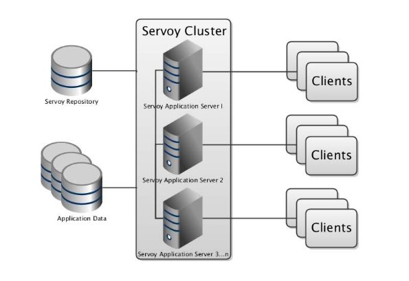

## CLÚSTER DE ALTA DISPONIBILIDAD (HA) EN PROXMOX

Adrián Milián Palomares 2º ASIR

**ÍNDICE**

1. [INTRODUCCIÓN............................................................................................................................3](#_page2_x56.70_y68.70)
1. [PROXMOX......................................................................................................................................4](#_page3_x56.70_y68.70)
4. [ESTRUCTURA DEL PROYECTO.................................................................................................5](#_page4_x56.70_y56.70)
4. [INSTALACIÓN DE PROXMOX....................................................................................................6](#_page5_x56.70_y56.70)
4. [CONFIGURACIÓN DE NFS........................................................................................................10](#_page9_x56.70_y128.60)

   [6.1 CONFIGURACIÓN NFS EN PROXMOX.............................................................................12](#_page11_x56.70_y56.70)

7. [CREACIÓN DE EL CONTENEDOR LXC DE UBUNTU 23.10.................................................13](#_page12_x56.70_y259.50)
8. [CREACIÓN DE LA RED NAT.....................................................................................................19](#_page18_x56.70_y128.60)
8. [CREACIÓN DEL CLÚSTER........................................................................................................22](#_page21_x56.70_y337.65)
8. [CONFIGURACIÓN DE LA HA..................................................................................................26](#_page25_x56.70_y68.70)
8. [INSTALACIÓN DE APACHE.....................................................................................................28](#_page27_x56.70_y56.70)
1. [ACCESO DESDE FUERA DE LA RED AL CONTENEDOR.............................................28](#_page27_x56.70_y299.30)
1. [CONFIGURACIÓN DE NUESTRO SITIO WEB................................................................29](#_page28_x56.70_y500.95)
12. [PRUEBA DE HA.........................................................................................................................32](#_page31_x56.70_y56.70)
13. [MONITORIZACIÓN...................................................................................................................35](#_page34_x56.70_y56.70)
13. [DURACIÓN DEL PROYECTO..................................................................................................37](#_page36_x56.70_y68.70)
13. [CONCLUSIÓN............................................................................................................................38](#_page37_x56.70_y68.70)
13. [BIBLIOGRAFÍA..........................................................................................................................39](#_page38_x56.70_y68.70)
## 1. **INTRODUCCIÓN**

El proyecto trata sobre tener 3 servidores **Proxmox** con un **clúster** creado entre ellos, y dentro de uno de los servidores, una máquina virtual con **Ubuntu**, **Apache**, de tal manera que si el servidor que contiene la máquina virtual falla, ésta migre hacia otro servidor y pueda seguir funcionando. 

Además, hay que configurar una máquina virtual externa con Ubuntu, con un almacenamiento compartido **NFS** implementado en el que se guarde la maquina virtual de Proxmox para su correcto funcionamiento.

## 2. **PROXMOX**

Proxmox Virtual Environment es un entorno de virtualización de servidor de código abierto. Es una distribución Linux basada en Debian que permite el despliegue y gestión de máquinas virtuales y contenedores. Incluye una consola Web y herramientas de línea de comandos, y proporciona una API REST para herramientas de terceros.

He decidido usar Proxmox ya que no lo he probado antes y porque es una herramienta de virtualización muy completa e interesante que puede ser una alternativa a **Hyper-V**.

## 3. **ESTRUCTURA DEL PROYECTO**

La estructura del proyecto contará con cuatro máquinas virtuales, tres de ellas formarán el clúster de Proxmox y la otra máquina será el servidor de almacenamiento compartido NFS.

Para generar esta estructura, he utilizado el software de virtualización **VMWARE Workstation**, esta estructura se detalla a continuación.

||**Proxmox 1**|**Proxmox 2**|**Proxmox 3**|**NFS**|
| :- | - | - | - | - |
|**Nombre**|Server1.local|Server2.local|Server3.local|Nfs.local|
|**IP**|192\.168.1.2|192\.168.1.3|192\.168.1.4|192\.168.1.40|
|**RAM**|5GB|5GB|5GB|4GB|
|**Disco Duro**|40GB|40GB|40GB|40GB|
|
**Interfaces** 

**de red**
|
Adaptador 

puente
|
Adaptador 

puente
|
Adaptador 

puente
|
Adaptador 

puente
|
|
**Versión** 

**del SO**
|Proxmox VE 8.1.2|
` `Proxmox VE

8\.1.2
|
` `Proxmox VE

8\.1.2
|
Ubuntu 

server 22.04
|

## 4. **INSTALACIÓN DE PROXMOX**

Antes de poner la máquina en marcha hay que poner la siguiente opción en la configuración de cada máquina Proxmox

Una vez arrancada la MV, seleccionamos la primera opción.

Luego tendrás que aceptar términos de la licencia para continuar con la instalación.

Seleccionas el disco.

Seleccionas el pais, zona horaria y la distribución del teclado.

Pones la contraseña.

Y por último la configuración de la red y el nombre del host (En este apartado sale sola la IP pero la puedes cambiar).

Una vez hecho todo esto se instalará, posteriormente te dará la IP y el puerto por el que escucha para entrar en la interfaz gráfica vía web. El usuario siempre es **root** y la contraseña la que hayas puesto.

Ahora se repetirán los mismos pasos pero para el servidor 2 y el 3 cambiando solo el nombre del host y la IP.

## 5. **CONFIGURACIÓN DE NFS**

Se instala la MV con ubuntu server.

Una vez instalada la MV hay que actualizar repositorios. **sudo apt update**

Después de actualizar se instala el siguiente paquete: **nfs-kernel-server**

Una vez instalado se crea el directorio **/var/nfs** y se cambia el propietario y grupo por **nobody:nogroup**

Luego hay que ir al fichero **/etc/exports** y debe quedar de la siguiente forma:

Ahora se crea la tabla NFS que contendrá las exportaciones de la carpeta compartida con el siguiente comando:

**sudo exportfs -a**

Para no tener problema con que la IP sea dinámica en netplan configuras la IP estática.

## **5.1 CONFIGURACIÓN NFS EN PROXMOX**
Para configurar el NFS creado dentro de Proxmox hay que ir a la web que te proporciona la MV con el puerto.

Dentro de la web hay que ir al apartado de Almacenamiento y agregar NFS

Al agregarlo aparecerá un ventana para poner ID, IP del servidor, la carpeta a exportar y elegir el contenido que puede tener.

Después de esto ya aparecerá en la lista de Almacenamiento

## 6. **CREACIÓN DE EL CONTENEDOR LXC DE UBUNTU 23.10**

Lo primero es instalar la plantilla para el contenedor que ofrece el propio proxmox de ubuntu 23.10, para esto hay que ir al almacenamiento NFS y ir al apartado de **Plantilla de CT**

Dentro de este apartado aparecerá **plantillas** y desde ahí aparecerá la siguiente ventana con todas las plantillas que dispone proxmox.

Desde aquí elegimos la plantilla que más queramos y le damos a descargar.

Una vez completado nos aparecerá en el apartado de **Plantillas de CT**.

Ahora ya se puede crear el contenedor lxc de Ubuntu,

para esto hay que crear el contenedor donde dice **Crear CT**

Al darle aparecerá la ventana de creación del contenedor donde se pondrá:

- Nombre y contraseña del contenedor

- Almacenamiento y plantilla que usará

- Tamaño del almacenamiento

- Número de núcleos

- Cantidad de RAM y swap

- Configuración de red

Este apartado se dejará sin IP por el momento por problemas que puede ocasionar con la red y no dejarte salir al exterior.

Siempre puedes probar si funciona con la instalación normal.

- Configuración de los DNS

Al iniciar el contenedor el usuario será **root** y la contraseña la que hayamos puesto en la instalación.

## 7. **CREACIÓN DE LA RED NAT**

Para la creación de la red nat hay que empezar creando una nueva interfaz de red, para ello hay que ir al apartado de red del servidor proxmox y darle a **Crear**.

Una vez le demos aparecerán varias opciones para la interfaz pero en este caso elegimos **Linux Bridge**.

Aparecerá una ventana para que pongamos el nombre de la interfaz, IP y de la interfaz que obtendrá la red.

En este caso solo se pondrá una IP que hará de puerta de enlace para la nueva red NAT y aplicaremos la configuración.

Una vez aplicada debe aparecernos la nueva interfaz creada

Ahora hay que tocar por terminal el fichero de **/etc/network/interfaces**.

Dentro de este fichero se añadirán nuevas lineas:

se ha añadido lo siguiente:

- Cambio a 1 el fichero de **ip\_forward** para poder enrutar
- 2 Reglas de Firewall para enmascarar los paquetes de la red y salgan por la interfaz vmbr0.

  Estos pasos hay que realizarlos en los otros 2 servidores para que cuando migre el contenedor sigue manteniendo la conexión a la red.

  Con esto creado iremos a la configuración de red del contenedor y añadiremos la interfaz creada, la IP que tendrá el contenedor y la puerta de enlace.

Ahora solo falta reiniciar el servidor y se aplicarán los cambios.

Iniciamos el contenedor y comprobamos que está saliendo al exterior.

Con esto la red NAT ya estaría saliendo fuera de su red.

## 8. **CREACIÓN DEL CLÚSTER**

Para la creación del clúster tendremos que acceder mediante consola a los servidores. Para ello, ejecutaremos la opción Shell de los servidores, que permite crear una conexión mediante VNC.

En los tres servidores hay que eliminar los repositorios de pago, en este caso es el siguiente:

**pve-enterprise.list** Y añadir el siguiente:

Una vez añadidos, actualizas los repositorios de los 3 servidores.

Ahora hay que añadir los servidores que formarán el clúster al archivo /etc/hosts de cada uno:

Comenzamos con la creación del clúster, en este caso el servidor 1 será el maestro y el resto secundarios. Para ello se ejecuta lo siguiente:

**pvecm create cluster**

Para comprobar que se ha creado ejecutamos **pvecm status**

El clúster se ha creado correctamente, ahora hay que añadir el servidor 2 y 3 con el siguiente comando en cada servidor (menos el 1):

**pvecm add [ip del servidor 1]**

Si vamos a cualquiera de los tres servidores y hacemos el status del clúster deben aparecer los 3 en la parte inferior y el cual es el local de esa máquina.

Si entramos en la Web en cada uno de los servidores aparecerán los 3, de esa forma sabemos que se han unido bien.

## 9. **CONFIGURACIÓN DE LA HA**

Para configurar los nodos en alta disponibilidad vamos a Centro de datos y en la pestaña HA.

Creamos el grupo llamado HA y seleccionas los 3 servidores.

Ahora añadimos el recurso a la MV creada, seleccionas el ID y marcas el grupo creado.

Una vez añadida la MV al grupo de HA, podremos ver como la máquina nos indica que está siendo administrada por HA.

## 10. **INSTALACIÓN DE APACHE**

Vamos al contenedor y instalamos el paquete de apache2

## 10.1 **ACCESO DESDE FUERA DE LA RED AL CONTENEDOR**

para que podamos ver la pagina de inicio de apache tenemos que habilitar en el firewall una regla de port forwarding para que las peticiones que entren a la IP del proxmox vayan redirigidas al puerto 80 de la ip del contenedor.

Para esto hay que ir a la terminal del servidor proxmox y en el mismo fichero que se han creado las reglas del firewall para tener red hay que poner lo siguiente:

post-up iptables -t nat -A PREROUTING -p tcp -d [ip servidor proxmox] --dport 80 -i vmbr0 -j DNAT --to-destination [ip contenedor]:80

Después de poner esta línea reiniciamos el servidor proxmox, cuando inicie también iniciamos el contenedor y probamos que funciona.

Estos pasos hay que repetirlos para cada servidor proxmox para cuando se haga la alta disponibilidad la página siga viendose.

## 10.2 **CONFIGURACIÓN DE NUESTRO SITIO WEB**

Lo que vamos a hacer es configurar apache para que en el navegador tengamos nuestra página funcionando.

Para ello hay que copiar el fichero **000-default.conf** y lo llamamos de otra forma.

Después de crearlo modificamos el fichero para que vaya a la ruta que creamos para que obtenga el fichero html y así mostrar la página

Mi fichero .conf:

Ahora que ya se ha configurado tenemos que ir a la ruta **/var/www** y crear la ruta que hayamos puesto en DocumentRoot.

Al crearlo entraremos en formulario y creamos el index.html en el que pondremos la página que más queramos

Ahora para que funcione debemos habilitar el sitio.

Esto se hace con **a2ensite [ fichero .conf ]**, para que no haya problemas con la página de inicio que tiene apache deshabilitamos su sitio con **a2dissite 000-default.conf**.

Con esto la página ya debería verse Mi página:

## 11. **PRUEBA DE HA**

Vamos a observar las posibles opciones a la hora de migrar el contenedor contenido en el servidor Proxmox.

Comenzamos simulando que, por algún motivo, el servidor que contiene el contenedor falla y podremos observar como la máquina migra hacia otro servidor para poder seguir funcionando.

Ahora, vamos a apagar el servidor 1 y ver como se cambia al servidor 2.

Como se puede ver se ha hecho la migración al otro servidor gracias a HA, si vamos al buscador debería seguir en funcionamiento.

La otra opción es la migración manual del contenedor. Para ello simplemente hay que dar con el botón derecho del ratón sobre el contenedor y **Migrar**

Le damos a Migrar y cambiará al servidor que le indiquemos, en este caso al servidor 3.

Si recargamos la página seguirá funcionando sin ningún problema.

## 12. **MONITORIZACIÓN**

Una de las grandes virtudes de Proxmox es la monitorización de los recursos que están en uso en los servidores, MV, contenedores y clústeres. No hace falta ningún programa externo.

Al llevarlo ya incluido se puede demostrar la versatilidad y usabilidad en entornos reales por el aprovechamiento de los recursos.

## 13. **DURACIÓN DEL PROYECTO**

Gracias al Diagrama de Gantt se puede hacer una aproximación del tiempo que se ha estado haciendo el proyecto.

## 14. **CONCLUSIÓN**

Como se ha podido observar, montar un clúster de alta disponibilidad en Proxmox es algo bastante sencillo de realizar gracias a la simplicidad que nos ofrece la interfaz web de Proxmox.

Hay que tener en cuenta que se necesita una infraestructura adecuada que quizá no todas las empresas se puedan permitir.

Si la empresa se pudiese permitir esta infraestructura sería una opción muy interesante y potente que sería capaz de ofrecer infinidad de servicios como pueden ser servidores web, servidores DNS, almacenamiento en base de datos, replicación, etc

## 15. **BIBLIOGRAFÍA**

Montar NFS:

[https://es.slideshare.net/slideshow/proyecto-asir-clster-de- alta-disponibilidad-en-proxmox-ve-44/77005507](https://es.slideshare.net/slideshow/proyecto-asir-clster-de-alta-disponibilidad-en-proxmox-ve-44/77005507)

Montar NFS en Proxmox:

[https://blog.unelink.es/wiki/montar-una-unidad-nfs-en- proxmox/](https://blog.unelink.es/wiki/montar-una-unidad-nfs-en-proxmox/)

Crear contenedor LXC:

[https://universodigital.org/crear-contenedor-lxc-en- proxmox-ve-paso-a-paso-2/](https://universodigital.org/crear-contenedor-lxc-en-proxmox-ve-paso-a-paso-2/)

Crear red NAT: [https://www.youtube.com/watch?v=ITYMeRE455g ](https://www.youtube.com/watch?v=ITYMeRE455g)[https://pve.proxmox.com/wiki/Network_Configuration ](https://pve.proxmox.com/wiki/Network_Configuration)Crear clúster en Proxmox: [https://pve.proxmox.com/wiki/Cluster_Manager ](https://pve.proxmox.com/wiki/Cluster_Manager)Añadir HA al clúster:

[https://www.maquinasvirtuales.eu/proxmox-configurar-ha- en-cluster/](https://www.maquinasvirtuales.eu/proxmox-configurar-ha-en-cluster/)
39
